# Lab 1A: Bash Scripts and Automation

## Step 1. Create the working directory

Create the directory that will contain all six scripts, the test files, logs, and backups.

```bash
mkdir ~/lab1a_bash && cd ~/lab1a_bash
```

## Step 2. Create `script1_sysinfo.sh`

This script stores the hostname, uptime, current user, date, and kernel version in variables. Each value is obtained through command substitution and printed in green ANSI colour.

```bash
nano script1_sysinfo.sh
```

Copy and paste this script:

```bash
#!/bin/bash

HOST_NAME="$(hostname)"
UP_TIME="$(uptime -p)"
CURRENT_USER="$(whoami)"
CURRENT_DATE="$(date)"
KERNEL="$(uname -r)"

echo -e "\e[32mHostname : $HOST_NAME\e[0m"
echo -e "\e[32mUptime           : $UP_TIME\e[0m"
echo -e "\e[32mCurrent User     : $CURRENT_USER\e[0m"
echo -e "\e[32mCurrent Date     : $CURRENT_DATE\e[0m"
echo -e "\e[32mKernel Version   : $KERNEL\e[0m"
```

Save the file, make it executable, and run it:

```bash
chmod +x script1_sysinfo.sh
bash script1_sysinfo.sh
```

The output should contain all five system values. Each output line should appear in green in a terminal.

Actual output:

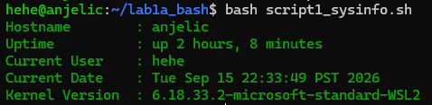

## Step 3. Create `script2_diskcheck.sh`

This script reads the usage of the root filesystem with `df`. The thresholds are tested from highest to lowest because a value above 90 is also above 70. The `TEST_USAGE` environment variable makes it possible to test all three outcomes without changing the real disk usage.

```bash
nano script2_diskcheck.sh
```

Copy and paste this script:

```bash
#!/bin/bash

if [[ -n "${TEST_USAGE:-}" ]]; then
        USAGE=$TEST_USAGE
else
        USAGE=$(df / | awk 'NR==2 {print $5+0}')
fi

if [ "$USAGE" -gt 90 ]; then
        echo "CRITICAL: Disk usage is ${USAGE}%"
elif [ "$USAGE" -gt 70 ]; then
        echo "WARNING: Disk usage is ${USAGE}%"
else
        echo "OK: Disk usage is ${USAGE}%"
fi
```

Save the file and run it against the actual root filesystem:

```bash
chmod +x script2_diskcheck.sh
bash script2_diskcheck.sh
```

Actual output:

 

Test the three threshold outcomes by setting `TEST_USAGE` for each command:

```bash
TEST_USAGE=85 bash script2_diskcheck.sh
TEST_USAGE=95 bash script2_diskcheck.sh
```

The expected results are `OK`, `WARNING`, and `CRITICAL`, respectively.

Actual output:

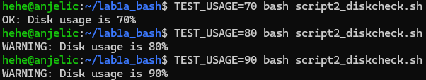

## Step 4. Create `script3_userreport.sh`

This script declares an array of accounts and uses `check_user()` to check each account. The account name is passed to the function as its first positional argument, `$1`.

```bash
nano script3_userreport.sh
```

Copy and paste this script:

```bash
#!/bin/bash

USERS=(sysadmin root nobody)

check_user() {
        local username="$1"

        if id "$username" >/dev/null 2>&1; then
                echo "FOUND: $username"
                id "$username"
        else
                echo "NOT FOUND: $username"
        fi

        echo "___________________________________________________________"
}

echo "Checking user accounts..."
echo

for user in "${USERS[@]}"; do
        check_user "$user"
done

echo "Total users checked: ${#USERS[@]}"
```

Save and run the report:

```bash
chmod +x script3_userreport.sh
bash script3_userreport.sh
```

Existing accounts should show their `id` output. Missing accounts should show `NOT FOUND`. The final line must report `Total users checked: 3`.

Actual output:

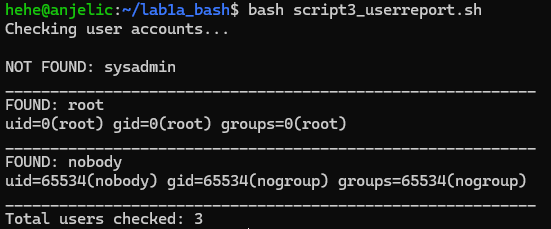

## Step 5. Create `script4_cleanup.sh`

This script uses strict mode and an `ERR` trap. It creates a disposable test tree under `~/lab1a_bash/tmptest`, ages one file by ten days, and deletes files older than seven days. Never point the `find` command at the live `/tmp` directory.

```bash
nano script4_cleanup.sh
```

Copy and paste this script:

```bash
#!/bin/bash

set -euo pipefail

trap 'echo "ERROR at line $LINENO" >> ~/lab1a_bash/error.log; exit 1' ERR

TEST_DIR="$HOME/lab1a_bash/tmptest"

mkdir -p "$TEST_DIR"

touch "$TEST_DIR/newfile.txt" "$TEST_DIR/oldfile.txt"
touch -d '10 days ago' "$TEST_DIR/oldfile.txt"

echo "Files before cleanup:"
ls -l "$TEST_DIR"

find "$TEST_DIR" -mtime +7 -delete

echo
echo "Files after cleanup:"
ls -l "$TEST_DIR"

echo
echo "Cleanup completed successfully."

exit 0
```

Run the successful cleanup:

```bash
chmod +x script4_cleanup.sh
bash script4_cleanup.sh
```

The old file should be deleted and the new file should remain.

Actual output:

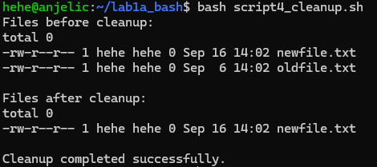

### Test Trap 1

Trigger an intentional error to test the trap. First remove the test directory and create a regular file with the same name. The script will fail when it tries to run `mkdir -p` on that path:

```bash
rm -rf tmptest
touch tmptest
bash script4_cleanup.sh
```

Actual output:

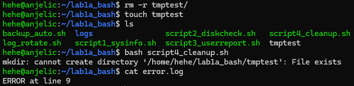

### Test Trap 2

List a directory that does not exist. Add "ls /fakedirectory" to the script:

```bash
...
trap 'echo "ERROR at line $LINENO" >> "$LOG_FILE"; exit 1' ERR

ls /fakedirectory
...
```

Actual output;

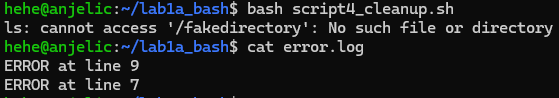

## Step 6. Create `log_rotate.sh`

The `rotate_log()` function accepts the log path as `$1`. It deletes version `.5`, shifts `.4` to `.5`, `.3` to `.4`, `.2` to `.3`, and `.1` to `.2`, then moves the current log to `.1`. The numbered names are created with parameter expansion from the supplied path.

```bash
nano log_rotate.sh
```

Copy and paste this script:

```bash
#!/bin/bash

rotate_log() {
        local log_file="$1"
        local base="${1%.log}"

        rm -f "${base}.5.log"

        for ((i=4; i>=1; i--)); do
                if [[ -f "${base}.${i}.log" ]]; then
                        mv "${base}.${i}.log"  "${base}.$((i + 1)).log"
                fi
        done

        if [[ -f "$log_file" ]]; then
                mv "$log_file" "${base}.1.log"
        fi
}

LOG_DIR="$HOME/lab1a_bash/logs"
LOG_FILE="$LOG_DIR/app.log"

mkdir -p "$LOG_DIR"

echo "Initial log entry" > "$LOG_FILE"

for j in {1..7}; do
        echo "[$(date '+%Y-%m-%d %H:%M:%S')] #$j Log entry before rotation" >> "$LOG_FILE"

        rotate_log "$LOG_FILE"

        echo "Log rotation #$j"
        echo "$(ls $LOG_DIR)"
        echo
done
```

Run the script:

```bash
chmod +x log_rotate.sh
bash log_rotate.sh
```

The directory is listed after every rotation. The files should be named `app.1.log` through `app.5.log`; there must never be an `app.6.log`. On rotations after the fifth, the oldest `.5` version should be discarded.

Check the final directory contents:

```bash
ls -1 logs/
```

Actual output:

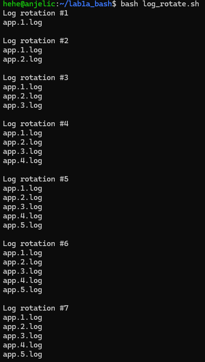


## Step 7. Create `backup_auto.sh`

This script creates a timestamped backup directory, copies the contents of `~/lab1a_bash/logs/` with `rsync`, and records start and end timestamps in `backup.log`. Its `ERR` trap records a failure timestamp and exits with status `1` if a command fails.

```bash
nano backup_auto.sh
```

Copy and paste this script:

```bash
#!/bin/bash

set -euo pipefail

BASE_DIR="$HOME/lab1a_bash"
SOURCE="$BASE_DIR/logs"
LOG_FILE="$BASE_DIR/backup.log"

trap 'echo "Failed $(date -Is)" >> "$LOG_FILE"; exit 1' ERR

DEST="$BASE_DIR/backup_$(date +%Y%m%d_%H%M%S)"

echo "START $(date -Is)" >> "$LOG_FILE"

mkdir -p "$DEST"

rsync -avz "$SOURCE/" "$DEST/" >> "$LOG_FILE" 2>&1

echo "END $(date -Is)" >> "$LOG_FILE"
echo "Backup completed: $DEST"
```

Save and run the backup TWICE. Wait at least one second between runs so that the timestamped directory names are different:

```bash
chmod +x backup_auto.sh
bash backup_auto.sh
```

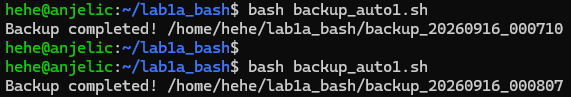

Confirm that two separate timestamped directories were created and inspect the backup log:

```bash
ls -d backup_2026*
cat backup.log
```

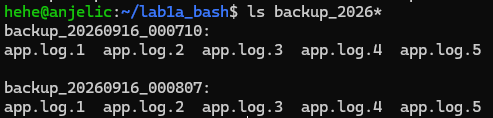

Restore one file from the first backup.

```bash
cp backup_20260916_000710/app.log.1 logs/app.log.1.restored
```

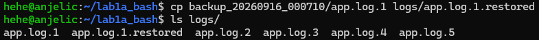

Verify that 2 are identical.

```bash
cp backup_20260916_000710/app.log.1 logs/app.log.1.restored
```

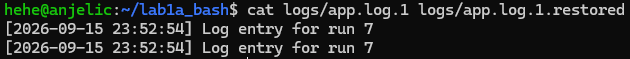

## Step 8. Configure and verify cron

Use absolute paths in the crontab because tilde expansion is not reliable in every cron implementation.

```bash
crontab -e
```

Add this entry:

```cron
*/5 * * * * /bin/bash /home/sysadmin/lab1a_bash/script2_diskcheck.sh >> /home/sysadmin/lab1a_bash/cron_disk.log 2>&1
```

If the account uses a different home directory, replace `/home/sysadmin` with the absolute path printed by:

```bash
echo "$HOME"
```

Save the crontab and confirm the entry:

```bash
crontab -l
```

Do not change the system clock. Either wait ten minutes for two five-minute runs, or temporarily use a once-per-minute schedule while testing:

```cron
* * * * * /bin/bash /home/sysadmin/lab1a_bash/script2_diskcheck.sh >> /home/sysadmin/lab1a_bash/cron_disk.log 2>&1
```

After at least two entries appear, edit the crontab again and restore the required `*/5` schedule. Verify both the redirected output and the cron service journal:

```bash
cat cron_disk.log
journalctl -u cron --since "20 min ago"
```

The cron output should contain disk status entries, and the journal should show the cron service launching the command. Use `journalctl` rather than `grep CRON /var/log/syslog`; a minimised Ubuntu Server installation may not include `rsyslog`, so `/var/log/syslog` may not exist.

Actual output:

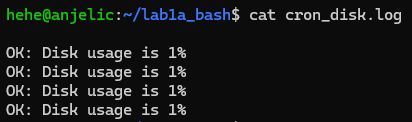

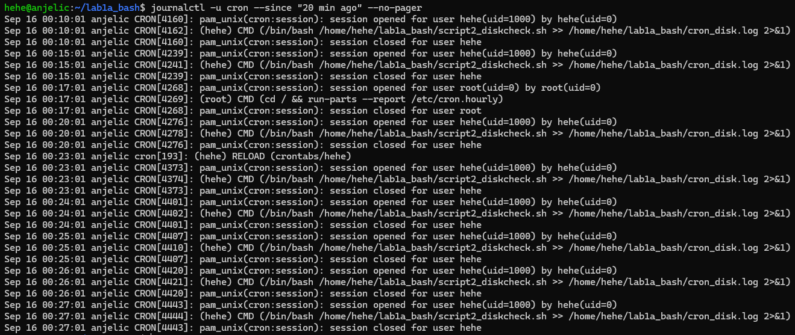

