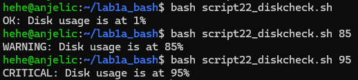
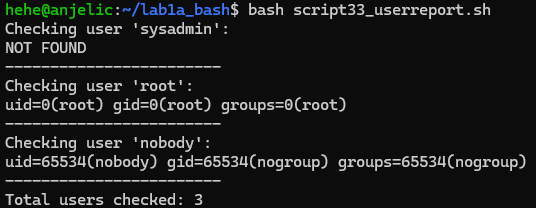
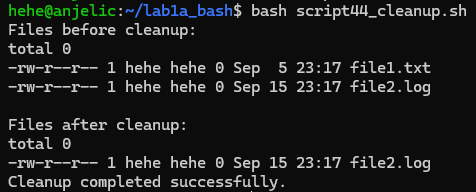
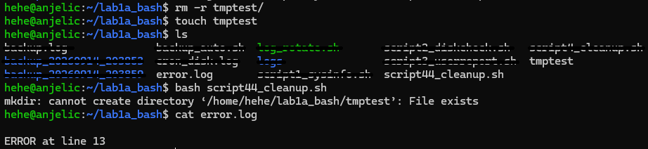
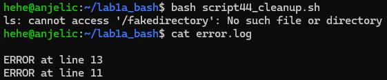
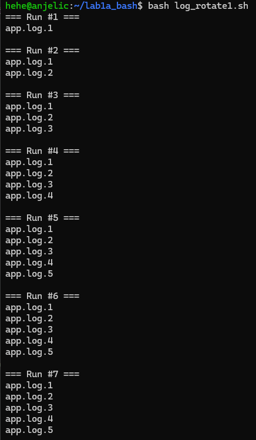

### Step 1. Create the working directory

```Shell
mkdir ~/lab1a_bash && cd ~/lab1a_bash
```

### Step 2. Create script1_sysinfo.sh

```Shell
nano script1_sysinfo.sh
```

Copy and paste this script:

```Shell
#!/bin/bash

host_name="$(hostname)"
up_time="$(uptime -p)"
user="$(whoami)"
current_date="$(date)"
kernel="$(uname -r)"

echo -e "\e[32mHostname : $host_name\e[0m"
echo -e "\e[32mUptime           : $up_time\e[0m"
echo -e "\e[32mCurrent User     : $user\e[0m"
echo -e "\e[32mCurrent Date     : $current_date\e[0m"
echo -e "\e[32mKernel Version   : $kernel\e[0m"
```

Save the file, then make it executable and run it.

```Shell
chmod +x script1_sysinfo.sh
bash script1_sysinfo.sh
```

The output should contain the hostname, readable uptime, current username, current date, and kernel version. Each line should include the green ANSI colour escape sequence when viewed in a terminal.

Actual output:


### Step 3. Create script2_diskcheck.sh

This script reads the root filesystem usage with `df`. The highest threshold must be tested first: a usage value above 90 is also above 70, so checking 70 first would prevent the `CRITICAL` branch from running.

```Shell
nano script2_diskcheck.sh
```

Copy and paste this script:

```bash
#!/bin/bash

if [ -n "$1" ]; then
    USAGE=$1
else
    USAGE=$(df / --output=pcent | tail -n 1 | tr -dc '0-9')
fi

if [ "$USAGE" -gt 90 ]; then
    echo "CRITICAL: Disk usage is at ${USAGE}%"
elif [ "$USAGE" -gt 70 ]; then
    echo "WARNING: Disk usage is at ${USAGE}%"
else
    echo "OK: Disk usage is at ${USAGE}%"
fi
```

Save the file and test the actual filesystem first:

```Shell
chmod +x script2_diskcheck.sh
bash script2_diskcheck.sh
```

Use the temporary value to demonstrate all outcomes. These tests do not change the real disk usage:

```Shell
bash script2_diskcheck.sh 85
bash script2_diskcheck.sh 95
```

Actual output:



### Step 4. Create script3_userreport.sh

This script uses an array and a function. The function receives each account name as its first positional argument, `$1`, and prints the account's `id` information when it exists.

```Shell
nano script3_userreport.sh
```

Copy and paste this script:

```bash
#!/bin/bash

USERS=(sysadmin root nobody)

check_user() {
    local username="$1"

    if id "$username" &>/dev/null; then
        id "$username"
    else
        echo "NOT FOUND"
    fi
}

for user in "${USERS[@]}"; do
    echo "Checking user '$user':"
    check_user "$user"
    echo "------------------------"
done

echo "Total users checked: ${#USERS[@]}"
```

Run the report:

```Shell
chmod +x script3_userreport.sh
bash script3_userreport.sh
```

The result depends on which accounts exist on the system. The final line must report the array count as `3`.

Actual output:



### Step 5. Create script4_cleanup.sh

Use strict mode and register the required `ERR` trap before creating the test tree. The script operates only on `~/lab1a_bash/tmptest`; never run the deletion command against the live `/tmp` directory.

```Shell
nano script4_cleanup.sh
```

Copy and paste this script:

```bash
#!/bin/bash

set -euo pipefail

LOG_DIR="$HOME/lab1a_bash"
LOG_FILE="$LOG_DIR/error.log"
TEST_DIR="$LOG_DIR/tmptest"

trap 'echo "ERROR at line $LINENO" >> "$LOG_FILE"; exit 1' ERR

mkdir -p "$LOG_DIR"

mkdir -p "$TEST_DIR"
touch "$TEST_DIR/file1.txt" "$TEST_DIR/file2.log"
touch -d '10 days ago' "$TEST_DIR/file1.txt"

echo "Files before cleanup:"
ls -l "$TEST_DIR"
echo

find "$TEST_DIR" -mtime +7 -delete

echo "Files after cleanup:"
ls -l "$TEST_DIR"
echo "Cleanup completed successfully."
exit 0
```

Run the successful cleanup. The ten-day-old file should be removed while the new file remains:

```Shell
chmod +x script4_cleanup.sh
bash script4_cleanup.sh
```

Actual output:



Test the trap with the optional intentional error. This command is expected to return exit status `1`:

#### Test Trap 1

Create a file named 'tmptest':

```Shell
touch tmptest
```

Run script4_cleanup again:

```Shell
bash script4_cleanup.sh
```

Confirm that the last line of `error.log` begins with `ERROR at line`. 

Actual output:



#### Test Trap 2

List a directory that does not exist.

Add "ls /fakedirectory" to the script:

```Shell
...
trap 'echo "ERROR at line $LINENO" >> "$LOG_FILE"; exit 1' ERR

ls /fakedirectory

mkdir -p "$LOG_DIR"
...
```

Test trap 2



### Step 6. Create log_rotate.sh

The rotation function deletes `.5` first, shifts `.4` through `.1` upward, and finally moves the current log to `.1`. The numbered names are built from the supplied path with parameter expansion.

```Shell
nano log_rotate.sh
```

Copy and paste this script:

```bash
#!/bin/bash

set -euo pipefail

LOG_DIR="$HOME/lab1a_bash/logs"
TARGET_LOG="$LOG_DIR/app.log"

rotate_log() {
    local file="$1"
    local base="${file%.log}"

    rm -f "${base}.log.5"

    for i in 4 3 2 1; do
        if [[ -f "${base}.log.${i}" ]]; then
            mv "${base}.log.${i}" "${base}.log.$((i + 1))"
        fi
    done

    if [[ -f "$file" ]]; then
        mv "$file" "${base}.log.1"
    fi
}

mkdir -p "$LOG_DIR"
rm -f "$LOG_DIR"/app.log*

for run in {1..7}; do
    echo "=== Run #$run ==="
    echo "[$(date '+%Y-%m-%d %H:%M:%S')] Log entry for run $run" >> "$TARGET_LOG"
  
    rotate_log "$TARGET_LOG"
  
    ls -1 "$LOG_DIR"
    echo ""
done
```

Run the script and inspect the directory after every rotation:

```Shell
chmod +x log_rotate.sh
bash log_rotate.sh
```

After the fifth rotation, the directory must never contain a `.6` file. The oldest `.5` file must be discarded before every later rotation.



```Shell
ls logs/
```


### Step 7. Create backup_auto.sh

This script creates a new timestamped destination, writes start and end timestamps to `backup.log`, and copies the log directory with `rsync`. The `ERR` trap records a failure timestamp and returns status `1` when a command fails.

```Shell
nano backup_auto.sh
```

Copy and paste this script:

```bash
#!/bin/bash

set -euo pipefail

LOG_FILE="backup.log"

trap 'echo "FAILED $(date -Is)" >> "$LOG_FILE"; exit 1' ERR

DEST="$HOME/lab1a_bash/backup_$(date +%Y%m%d_%H%M%S)"
mkdir -p "$DEST"

echo "START: $(date -Is)" >> "$LOG_FILE"

rsync -avz "$HOME/lab1a_bash/logs/" "$DEST/" >> "$LOG_FILE" 2>&1

echo "END:   $(date -Is)" >> "$LOG_FILE"
echo "Backup completed! $DEST"
```

Run the backup TWICE. Wait at least one second between runs if both commands might execute during the same second, because the timestamp is part of the directory name:

```Shell
chmod +x backup_auto.sh
bash backup_auto.sh
```


Verify that there are two separate timestamped directories:

```Shell
ls backup_2026*
```


Restore one file from the first backup.

```Shell
cp backup_20260916_000710/app.log.1 logs/app.log.1.restored
```


Verify that 2 are identical.

```Shell
cat logs/app.log.1 logs/app.log.1.restored
```


### Step 8. Configure and verify cron

Check the home directory before installing the cron entry. The crontab must use absolute paths; do not rely on `~` being expanded by cron.

```Shell
crontab -e
```

Add this line if the account home is `/home/sysadmin`:

```cron
*/5 * * * * /bin/bash /home/sysadmin/lab1a_bash/script2_diskcheck.sh >> /home/sysadmin/lab1a_bash/cron_disk.log 2>&1
```

If the account uses a different home directory, replace both `/home/sysadmin` prefixes with the absolute path printed by `echo "$HOME"`. Save the crontab and confirm the entry:

```Shell
crontab -l
```

Do not change the system clock. To test without waiting ten minutes, temporarily change the schedule to once per minute:

```cron
* * * * * /bin/bash /home/sysadmin/lab1a_bash/script2_diskcheck.sh >> /home/sysadmin/lab1a_bash/cron_disk.log 2>&1
```

Wait until at least two entries have appeared (2 minutes), then edit the crontab again and restore the required `*/5` schedule. Check the redirected output and the cron service journal:

```Shell
cat cron_disk.log
journalctl -u cron --since "20 min ago" --no-pager
```


Use `journalctl` for the service check. A minimized Ubuntu Server installation may not have `/var/log/syslog`, so searching that file is not a reliable verification method.
